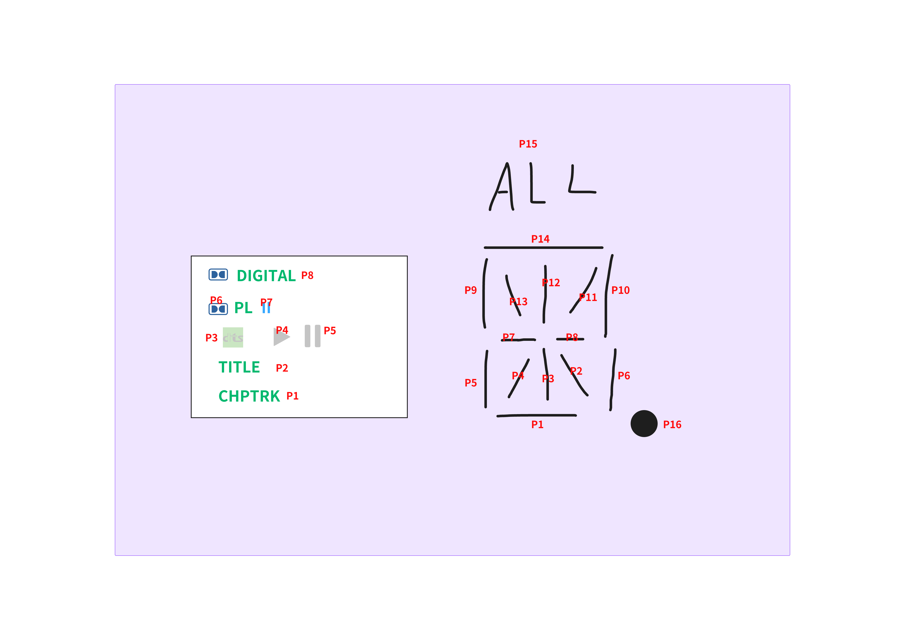

<!--
 * @Description: 
 * @Blog: saisaiwa.com
 * @Author: ccy
 * @Date: 2024-05-31 10:53:09
 * @LastEditTime: 2024-06-25 11:47:27
-->
# VFD Desktop Clock Ornament (Reverse Display)

	

		
		
	

	
&nbsp;

### VFD screen info
- Name: VFD
- Brand: BOE
- Model: VFD16-1002B
- PIN: 10GR and 16SG

### Peripheral
- DHT20 Temperature and humidity sensors
- RX8025T Real-time clock
- PT6315 VFD drives

### Other

Hardware open source address: https://oshwhub.com/yc_chen/boe-vfd-display-screen-deskt

### Driver program - V1.1
**MCU:** STC8H8K64U

**IRC Frequency:** 24Mhz

Use the USB downloader program, the CDC serial port is turned on by default, and it can be downloaded automatically after compilation without power-off

### About

Create By saisaiwa

Blog: https://www.saisaiwa.com

Email: yustart@foxmail.com

