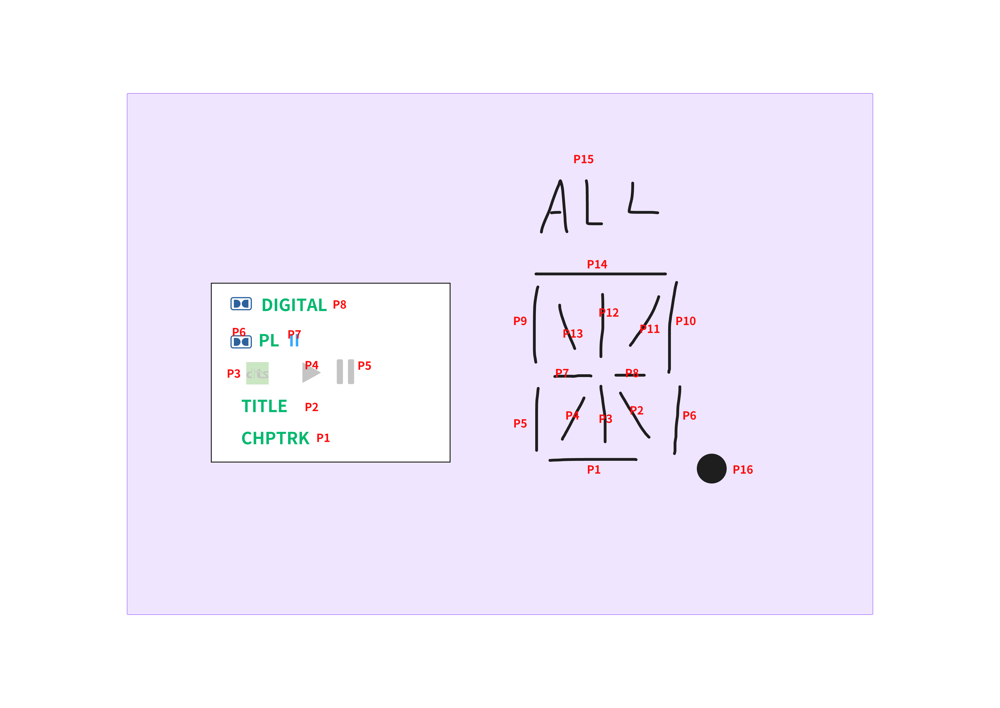
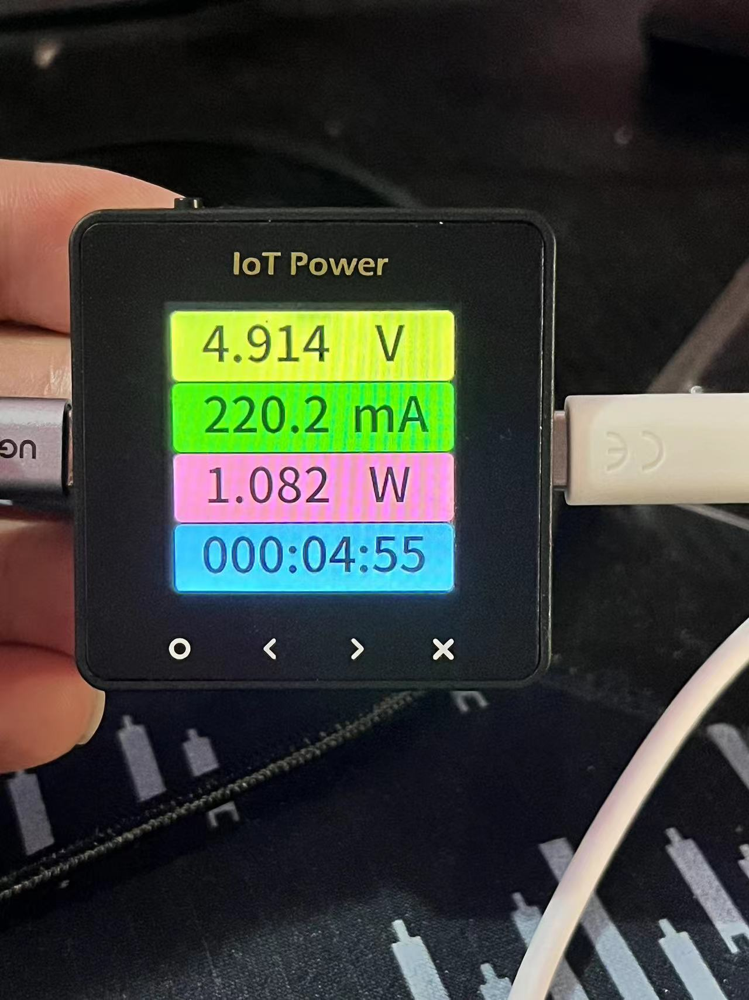
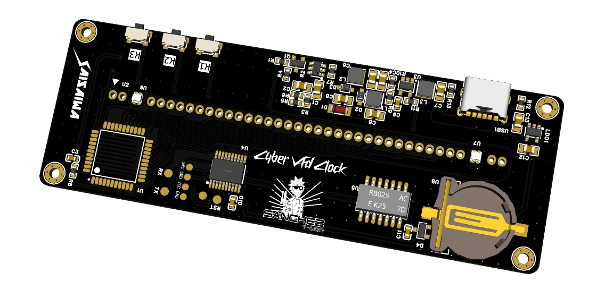
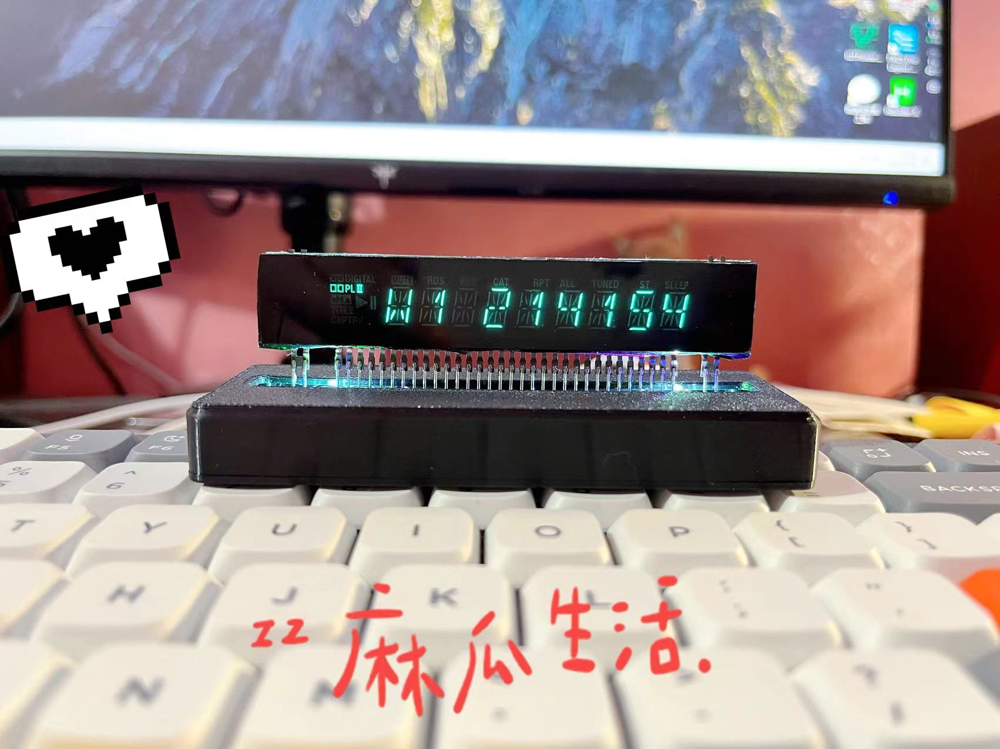

<!--
 * @Description: 
 * @Blog: saisaiwa.com
 * @Author: ccy
 * @Date: 2024-05-31 10:53:09
 * @LastEditTime: 2024-08-16 16:02:28
-->
# VFD Desktop Clock Ornament (Reverse Display)

	

		
		
	

	
&nbsp;

### VFD screen info
- Name: VFD
- Brand: BOE
- Model: VFD16-1002B
- PIN: 10GR and 16SG

### Peripheral
- RX8025T Real-time clock
- PT6315 VFD drives

### Other

### Driver program - V1.1
**MCU:** PY32F002B

### Engineering documents

FilePath: doc\VFD-BOE1002B-PY32_LCEDA-PRO.epro

Use: lceda pro import the file

### 3D printing files

FilePath: doc\xxx.stl

### Flash the firmware

FilePath: doc\Project.hex

### About

Create By saisaiwa

Blog: https://www.saisaiwa.com

Email: yustart@foxmail.com

